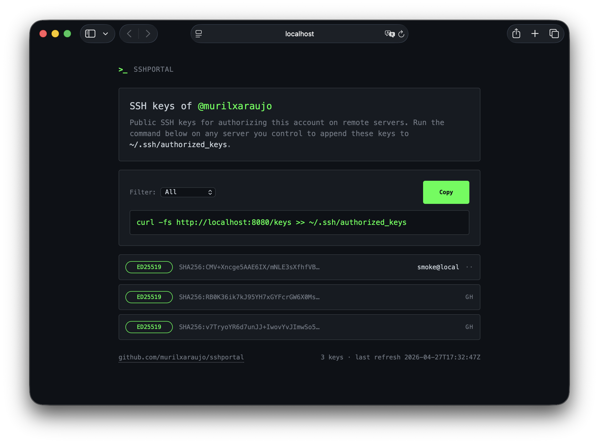

<div align="center">

# SSHPortal

**Self-hosted SSH public key distribution. One URL, one curl, every server you own.**

[](https://github.com/murilxaraujo/SSHPortal/actions/workflows/ci.yml)
[](https://github.com/murilxaraujo/SSHPortal/actions/workflows/release.yml)
[](https://murilxaraujo.github.io/SSHPortal/)
[](LICENSE)
[](https://swift.org)
[](https://github.com/murilxaraujo/SSHPortal/pkgs/container/sshportal)

</div>

<p align="center">
  
</p>

SSHPortal is a small Swift HTTP server inspired by [SSH.id](https://sshid.io). It publishes your public SSH keys behind a single URL, renders a terminal-themed web page for humans, and serves a plain-text endpoint that pipes straight into `~/.ssh/authorized_keys`. Run it on a $5 VPS, point your DNS at it, and never copy a key by hand again.

---

## Table of contents

- [Features](#features)
- [Quickstart](#quickstart)
- [How it works](#how-it-works)
- [Configuration](#configuration)
- [HTTP endpoints](#http-endpoints)
- [Deployment](#deployment)
- [Development](#development)
- [Documentation](#documentation)
- [Security](#security)
- [Roadmap](#roadmap)
- [Contributing](#contributing)
- [License](#license)

---

## Features

- 🟢 **One URL, one command** — `curl -fs https://keys.example.com/keys >> ~/.ssh/authorized_keys`
- 🌐 **Multi-source merging** — pulls from GitHub `.keys`, GitLab `.keys`, and inline YAML
- 🔁 **Hot reload** — re-fetches every `REFRESH_INTERVAL` and re-reads `keys.yaml`; no restart needed
- 🧹 **Dedupe by SHA-256 fingerprint** — same key from multiple sources appears once
- 🎨 **Terminal-themed UI** with copy-to-clipboard, per-type filter, configurable accent color
- 🔒 **Read-only by design** — no auth, no writes, nothing to compromise that wasn't already public
- 🚦 **Rate limiting** — 60 req/min/IP token bucket, respects `X-Forwarded-For`
- 📦 **Single static container** — multi-arch image on `ghcr.io`, runs as non-root
- 🍎 **Apple `container` framework** support for the macOS dev loop
- 🛑 **Graceful shutdown** — `SIGINT`/`SIGTERM` exits cleanly via `ServiceGroup`

## Quickstart

The fastest path is the prebuilt image. Pick whichever container runtime you have.

<details open>
<summary><b>Apple <code>container</code> (macOS, native)</b></summary>

```bash
container system start

cat > keys.yaml <<'YAML'
title: yourhandle
sources:
  github:
    - your-github-username
YAML

container run -d --name sshportal \
  -p 8080:8080 \
  -v "$PWD/keys.yaml:/config/keys.yaml:ro" \
  -e BASE_URL=http://localhost:8080 \
  ghcr.io/murilxaraujo/sshportal:latest
```

</details>

<details>
<summary><b>Docker / Podman</b></summary>

```bash
docker run -d --name sshportal \
  -p 8080:8080 \
  -v "$PWD/keys.yaml:/config/keys.yaml:ro" \
  -e BASE_URL=http://localhost:8080 \
  ghcr.io/murilxaraujo/sshportal:latest
```

</details>

<details>
<summary><b>From source</b></summary>

```bash
git clone https://github.com/murilxaraujo/SSHPortal.git
cd SSHPortal
KEYS_FILE=config/keys.example.yaml swift run App
```

</details>

Open <http://localhost:8080>. On any server you control:

```bash
curl -fs https://keys.example.com/keys >> ~/.ssh/authorized_keys
```

Or use the idempotent helper that skips already-authorized keys:

```bash
PORTAL=https://keys.example.com bash <(curl -fsSL https://keys.example.com/install.sh)
```

## How it works

```
┌──────────┐   GET /, /keys, /keys/:type, /health
│  Client  │ ─────────────────────────────────────┐
└──────────┘                                      ▼
                                       ┌──────────────────────┐
                                       │  RateLimitMiddleware │  60 req/min/IP
                                       └──────────┬───────────┘
                                                  ▼
                                 ┌──────────────────────────────┐
                                 │  Hummingbird Router          │
                                 └──┬────────────┬──────────────┘
                                    ▼            ▼
                           ┌──────────────┐  ┌────────────┐
                           │  WebRoutes   │  │ KeyRoutes  │
                           │  IndexView   │  │ plain text │
                           └──────┬───────┘  └─────┬──────┘
                                  └────────┬───────┘
                                           ▼
                                    ┌─────────────┐
                                    │  KeyStore   │  (actor)
                                    └──────┬──────┘
                                           ▲ replaceAll(...)
                                ┌──────────┴────────────┐
                                │     RefreshService    │  every REFRESH_INTERVAL
                                └──────────┬────────────┘
                                           ▼
                                    ┌─────────────┐
                                    │  KeyLoader  │
                                    └──┬────────┬─┘
                                       ▼        ▼
                           ┌────────────┐  ┌───────────────────┐
                           │ keys.yaml  │  │ RemoteKeyFetcher  │
                           │  (manual)  │  │  github / gitlab  │
                           └────────────┘  └───────────────────┘
```

Manual keys override remote ones with the same fingerprint; GitHub overrides GitLab. A failure on any single source is logged and ignored — the others still load. See the [Architecture article](https://murilxaraujo.github.io/SSHPortal/documentation/app/architecture) for the full breakdown.

## Configuration

### `keys.yaml`

```yaml
title: yourhandle
sources:
  github:
    - your-github-username
  gitlab:
    - your-gitlab-username
  manual:
    - comment: "Yubikey (laptop)"
      key: "sk-ecdsa-sha2-nistp256@openssh.com AAAA... user@yk"
    - comment: "Recovery key"
      key: "ssh-ed25519 AAAA... me@air"
```

The file is re-read on every refresh tick; edits take effect within `REFRESH_INTERVAL` seconds.

### Environment variables

| Variable | Default | Purpose |
|---|---|---|
| `PORT` | `8080` | HTTP listen port |
| `HOST` | `0.0.0.0` | Bind address |
| `BASE_URL` | `http://localhost:8080` | Public URL embedded in install command shown in the UI |
| `TITLE` | _(yaml `title:`)_ | UI heading; overrides yaml when set |
| `KEYS_FILE` | `/config/keys.yaml` | Path to YAML config |
| `REFRESH_INTERVAL` | `3600` | Seconds between refreshes (`0` = startup only) |
| `THEME_COLOR` | `#00FF41` | Accent color (any valid CSS color) |
| `LOG_LEVEL` | `info` | `debug` / `info` / `warning` / `error` |

Title precedence: `TITLE` env → `keys.yaml`'s `title:` → default `sshportal`.

## HTTP endpoints

| Method | Path | Returns |
|---|---|---|
| `GET` | `/` | HTML web UI |
| `GET` | `/keys` | All keys, `text/plain` |
| `GET` | `/keys/:type` | Filtered by `ed25519` / `rsa` / `ecdsa` / `ecdsa-sk` / `ed25519-sk`. 404 on unknown |
| `GET` | `/health` | `{"status":"ok","keys_loaded":N,"last_refresh":"..."}` |

All endpoints are public, read-only, rate-limited (60 req/min/IP), and emit `Cache-Control: no-store`.

## Deployment

### Behind TLS

The container speaks plain HTTP. Put it behind a reverse proxy that terminates TLS. Caddy is the smallest path:

```caddy
keys.example.com {
  reverse_proxy localhost:8080
}
```

For nginx and a containerless `systemd` unit, see the [Deployment article](https://murilxaraujo.github.io/SSHPortal/documentation/app/deployment).

### Health probes

```yaml
livenessProbe:
  httpGet: { path: /health, port: 8080 }
  periodSeconds: 30
```

`/health` never blocks on remote fetches — safe for tight probe intervals.

## Development

```bash
# Build & test
swift build
swift test

# Run with the example config
KEYS_FILE=config/keys.example.yaml swift run App

# Build a multi-arch image locally with Apple's `container`
container build -t sshportal:dev .

# Or with Docker
docker build -t sshportal:dev .

# Or via the Swift Container Plugin (no Docker needed)
swift package --allow-network-connections all build-container-image \
  --repository ghcr.io/murilxaraujo/sshportal --tag dev
```

Stack: Swift 6.2 · [Hummingbird 2](https://github.com/hummingbird-project/hummingbird) · [AsyncHTTPClient](https://github.com/swift-server/async-http-client) · [Yams](https://github.com/jpsim/Yams) · [swift-crypto](https://github.com/apple/swift-crypto) · [swift-container-plugin](https://github.com/apple/swift-container-plugin) · [swift-docc-plugin](https://github.com/swiftlang/swift-docc-plugin).

## Documentation

Full API reference and articles are auto-built from the source by DocC and published to GitHub Pages on every push to `main`:

**👉 [murilxaraujo.github.io/SSHPortal](https://murilxaraujo.github.io/SSHPortal/)**

Articles:
- [Getting Started](https://murilxaraujo.github.io/SSHPortal/documentation/app/gettingstarted)
- [Configuration](https://murilxaraujo.github.io/SSHPortal/documentation/app/configuration)
- [Deployment](https://murilxaraujo.github.io/SSHPortal/documentation/app/deployment)
- [Security](https://murilxaraujo.github.io/SSHPortal/documentation/app/security)
- [Architecture](https://murilxaraujo.github.io/SSHPortal/documentation/app/architecture)

Preview docs locally:

```bash
swift package --disable-sandbox preview-documentation --target App
```

## Security

- Always serve over HTTPS. Without TLS, a network attacker can substitute keys in transit.
- Container runs as a non-root `sshportal` user (UID 1000).
- All Swift dependencies pinned via `Package.resolved`.
- HTML output escapes user-controlled fields.
- See the [Security article](https://murilxaraujo.github.io/SSHPortal/documentation/app/security) for the full threat model.

Found a vulnerability? Email `murilo@muriloaraujo.com` rather than opening a public issue.

## Roadmap

- [ ] FIDO2 passkey signing optional integration
- [ ] Optional `Cache-Control: max-age` for public mirroring
- [ ] Webhook to push refresh on GitHub key changes
- [ ] Per-key expiry timestamps in YAML
- [ ] Light/high-contrast theme

Open an issue if any of these would unblock you.

## Contributing

PRs welcome. The project is small enough to read in one sitting — start at `Sources/App/App.swift`. Conventions:

- TDD for non-trivial changes; the test target lives in `Tests/AppTests`.
- Conventional Commits (`feat:`, `fix:`, `docs:`, …).
- `swift test` must pass before review.

For substantial changes, open an issue first to align on direction.

## License

[MIT](LICENSE) © 2026 Murilo Araujo

Inspired by [SSH.id by Termius](https://sshid.io).
